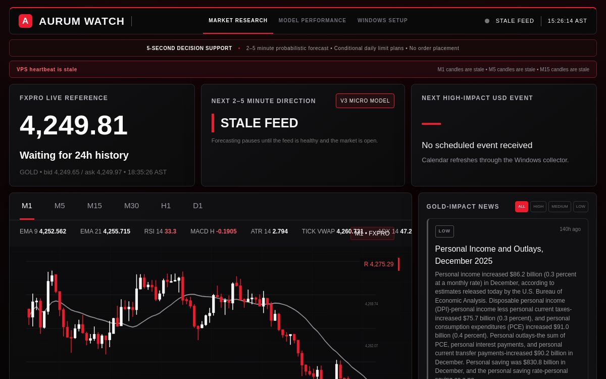
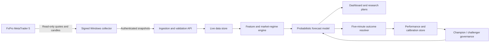

# Aurum Watch

**A live XAU/USD market-intelligence and model-monitoring platform**

[Open the live dashboard](https://live-dashboard.x5s868y9wv.chatgpt.site) · [Connect on LinkedIn](https://www.linkedin.com/in/navar-nasr/)

## Overview

Aurum Watch is an actively developed market-research platform for gold (`XAU/USD`). It combines read-only MetaTrader 5 data, multi-timeframe technical analysis, event and news context, short-horizon probabilistic forecasts, and continuous out-of-sample evaluation.

The project was built to answer a broader question than “where will price move next?”:

> Can a live forecasting system measure its own reliability, detect weak data, and communicate uncertainty clearly enough to support better human decisions?

It does **not** place, modify, or close trades.

## Product capabilities

- Collects read-only gold quotes approximately every five seconds
- Processes M1 through D1 candles and multiple market regimes
- Combines trend, momentum, volatility, price structure, and multi-timeframe confirmation
- Incorporates recent market events, headlines, and macroeconomic drivers
- Produces `UP`, `DOWN`, or `NEUTRAL` forecasts for the next 2–5 minutes
- Records confidence, reasoning, invalidation context, and the neutral decision band
- Resolves forecasts against later live prices at the five-minute boundary
- Tracks accuracy, Brier score, calibration, class balance, and rolling performance
- Maintains model versions with promotion, rejection, and rollback controls
- Generates research-oriented daily buy-limit and sell-limit scenarios with risk context
- Detects stale feeds and poor-quality observations before issuing forecasts

## System architecture

The platform separates data collection, authenticated ingestion, forecasting, evaluation, and presentation. This makes live-data health and model health independently observable.

## Forecasting and evaluation

Each eligible forecast stores:

- Starting mid-price and timestamp
- Directional class and probability distribution
- Model version and input-data quality
- Forecast-specific neutral threshold
- Technical and macroeconomic reasoning
- Resolution price, outcome, and scoring information

The neutral threshold adapts to current spread and volatility. Forecasts are resolved using the first fresh mid-price at or after five minutes. This avoids quietly changing the scoring rule after predictions are issued.

Performance monitoring includes:

- Overall and recent directional accuracy
- Three-class Brier score
- Confidence calibration
- Per-class precision and recall
- Model-version comparisons
- Holdout evaluation before model promotion
- Stale-data and low-quality forecast suppression

## Engineering highlights

- Full-stack TypeScript application
- React-based responsive dashboard
- Edge-hosted API routes
- Durable SQL-backed market, forecast, and model history
- HMAC-signed ingestion with timestamp and nonce validation
- Replay protection and payload-size controls
- Read-only Python/MetaTrader 5 collector
- Automated Windows installation and upgrade workflow
- Live model governance and owner-protected rollback

## Safety boundary

Aurum Watch is intentionally separated from order execution:

- No broker password is stored by the dashboard
- No trade-placement capability is implemented
- Collector traffic is authenticated and replay-resistant
- Administrative model actions require separate owner authorization
- Private credentials and production source are excluded from this portfolio repository

The live platform is research and decision-support software, not an automated trading system.

## Development status

This repository is a sanitized portfolio case study of the current stable checkpoint. Aurum Watch remains under active development, with production code and credentials kept separate.

Completed:

- Live read-only data collection
- Five-second update cycle
- 2–5-minute forecast and five-minute resolution process
- Dynamic neutral classification
- Performance, calibration, and model-history views
- Daily research scenarios
- Signed ingestion and replay protection

In progress:

- Stronger local credential protection and rotation workflow
- Faster first-cycle health confirmation
- Clearer collector identity and last-accepted-submission reporting
- Expanded model-governance documentation
- More complete operational, retention, and uninstall documentation

## What this project demonstrates

- Designing an end-to-end live data product rather than an isolated model
- Translating noisy market data into measurable probabilistic decisions
- Building feedback loops that score and challenge a model over time
- Treating data quality, security, uncertainty, and failure states as product features
- Connecting Python data collection with a deployed TypeScript application
- Communicating technical outputs to nontechnical users

## Responsible-use disclaimer

Short-horizon financial markets are noisy and non-stationary. Forecast confidence is not a guarantee, and a correct direction does not imply profitability after spread, latency, slippage, or execution constraints. Aurum Watch is an experimental research platform and does not provide financial advice.

## Author

**Navar Nasr** — MSc Data Science, with a background in banking and financial services.

[GitHub](https://github.com/navarnasr) · [LinkedIn](https://www.linkedin.com/in/navar-nasr/)
